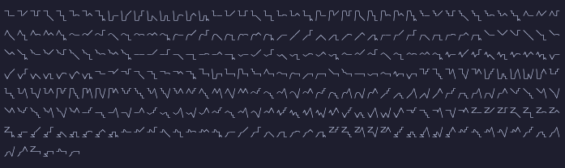

# Lingua Sona

**Lingua Sona**, or "Language of Wisdom" is a constructed world-language project designed for clarity, global pronounceability, and high compatibility with technical writing, research documentation, and artificial intelligence systems.

<!-- Core Project Badges -->


<!-- Tools Used -->


<!-- Language Identity -->


It is intentionally *not* a naturalistic language. Lingua Sona prioritizes:
- phonetic regularity
- explicit structure
- deterministic parsing
- low ambiguity under formal use

---

## Project Status

Lingua Sona is in **late foundational design**.

- Core phonology and glyph order are finalized
- Alphabet size is now stable
- Documentation is actively being consolidated and cleaned

This repository serves as the **authoritative specification**.

---


## 🤝 Support the Project

Lingua Sona is an open, long-term language design project built carefully and deliberately.

If you find this work valuable and want to help sustain its development, optional sponsorship is available:

👉 **https://github.com/sponsors/DevonXDal**

Support is transparent, never required, and does not influence design decisions. We appreciate all who choose to do so.  
For details, see **[FUNDING.md](./FUNDING.md)**.

---

## Design Goals

### Primary Goals

Lingua Sona is designed first for:

- **Technical and scientific writing**
- **Research papers and formal documentation**
- **AI training, prompting, and machine parsing**

Early adoption is expected in environments where:
- unambiguous grammar matters more than expressiveness
- consistency is more important than tradition
- learnability must scale across cultures

### Secondary Goals

- Human-to-human communication
- Creative writing and poetry
- Spoken conversation with minimal accent barriers

---

## 🧬 Core Inspirations

Lingua Sona draws linguistic and structural inspiration from:
- **French** → sentence flow & grammar 
- **Swahili** → logical morphology, CV structure 
- **Toki Pona / Toki Ma** → conceptual grounding & simplicity 
- **Japanese** → phonetic vowel system & universal pronounceability 

Originally named **Toki Sona**, the project grew beyond its roots into a language of its own design. 

---

## Core Design Principles

- **"World Language" Candidacy Ready Design**: A language meant to be a candidate for a world language.
- Function across both **personal and professional** contexts
- Optimize **writing density**—more meaning in fewer characters 
- Stay within a **hard limit of 1,750 terms** to reduce memorization load for core language word.
- **Phonetic orthography**: hear once → spell correctly
- **Mandatory evidentiality** for factual claims
- **Deterministic grammar** (low syntactic ambiguity)
- **Glyph-based writing system** to reduce memorization load
- **Language-first, script-second** design philosophy
- **Context Clues System (Za/Ze/Zi/Zo/Zu)** – most words’ type (person, place, object, verb, adjective, concept, etc.) is contextually encoded.

---

## Alphabet Overview

Lingua Sona uses a **glyph-compositional alphabet**.

- Letters are composed of two glyphs
- Glyphs represent phonetic components (consonant, vowel, cluster, negation)
- Learning 36 glyphs enables construction of the full alphabet

### Letter Counts

- **Core letters:** 251
- **Non-core / foreign extensions:** 56

### **Total alphabet size:** **307 letters**

---

## Alphabet Structure

Letters are derived from five structural classes:

1. **Consonant + Vowel (CV)**
2. **Vowel-initial (¬V)**
3. **Consonant-final (C¬)**
4. **Consonant + Vowel Cluster (CVV)**
5. **Vowel-Cluster-initial (¬VV)**

These forms are mechanically generated from the glyph order.

### Figure A - Letter System



*Figure: Complete Lingua Sona letter system rendered using Base64-embedded PUA fonts in Obsidian.*

---

## Glyph Order (Canonical)

The following order is the **master derivation order**. All letters, sorting, and tooling derive from it. Each glyph has its own design with consonants taking the left side of the letter and vowels/diaphrongs taking the right side.

```
P, B, T, D, K, G, M, N, F, V, S, SH, L, W, Y, H, CH,
A, AHW, E, I, ON, O, U, OOO,
AI, EI, OI, AU, OU,
Z, R, J, TH
```

> Glyph order is phonological, **not alphabetical**.

---

## Core Consonants (IPA)


| Glyph  | IPA   | Description                            |
| :----- | :---- | :------------------------------------- |
| **P**  | /p/   | [Voiceless bilabial stop][p]           |
| **B**  | /b/   | [Voiced bilabial stop][b]              |
| **T**  | /t/   | [Voiceless alveolar stop][t]           |
| **D**  | /d/   | [Voiced alveolar stop][d]              |
| **K**  | /k/   | [Voiceless velar stop][k]              |
| **G**  | /g/   | [Voiced velar stop][g]                 |
| **M**  | /m/   | [Bilabial nasal][m]                    |
| **N**  | /n/   | [Alveolar nasal][n]                    |
| **F**  | /f/   | [Voiceless labiodental fricative][f]   |
| **V**  | /v/   | [Voiced labiodental fricative][v]      |
| **S**  | /s/   | [Voiceless alveolar fricative][s]      |
| **SH** | /ʃ/   | [Voiceless postalveolar fricative][sh] |
| **L**  | /l/   | [Alveolar lateral approximant][l]      |
| **W**  | /w/   | [Voiced labial–velar approximant][w]   |
| **Y**  | /j/   | [Voiced palatal approximant][y]        |
| **H**  | /h/   | [Voiceless glottal fricative][h]       |
| **CH** | /t͡ʃ/ | [Voiceless postalveolar affricate][ch] |


---

## Core Vowels (IPA)


| Glyph   | IPA       | Description                          |
| :------ | :-------- | :----------------------------------- |
| **A**   | /a/       | [Open front unrounded vowel][a]      |
| **AHW** | /ɑ/       | [Open back unrounded vowel][aw]      |
| **E**   | /e/       | [Close-mid front unrounded vowel][e] |
| **I**   | /i/       | [Close front unrounded vowel][i]     |
| **ON**  | /ɤ/ ~ /ɯ/ | [Close-mid back unrounded vowel][on] |
| **O**   | /ɔ/       | [Open-mid back rounded vowel][o]     |
| **U**   | /u/       | [Close back rounded vowel][u]        |
| **OOO** | /ʉ/       | [Close central rounded vowel][ooo]   |


---

## Vowel Clusters (Diphthongs)


| Glyph | IPA | Audio Reference |
|:--|:--|:--|
| **AI** | /aɪ/ | [AI sample][ai] |
| **EI** | /eɪ/ | [EI sample][ei] |
| **OI** | /ɔɪ/ | [OI sample][oi] |
| **AU** | /aʊ/ | [AU sample][au] |
| **OU** | /oʊ/ | [OU sample][ou] |

You can see a guide on how to pronounce these vowel clusters or 'diphthongs' here:
[Pronounciation Studio](https://pronunciationstudio.com/pronunciation-guide-diphthong-vowel-sounds/)

---

## Non-Core / Foreign Consonants

These are permitted for proper nouns, loanwords, and fidelity of names.


| Glyph  | IPA       | Description                        |
| :----- | :-------- | :--------------------------------- |
| **Z**  | /z/       | [Voiced alveolar fricative][z]     |
| **R**  | /ɹ/ ~ /r/ | [Rhotic (dialect-dependent)][r]    |
| **J**  | /d͡ʒ/     | [Voiced postalveolar affricate][j] |
| **TH** | /θ/ ~ /ð/ | [Dental fricatives][th]            |

---

## 🧰 Tools & Infrastructure
Lingua Sona is developed using:
- 🪶 **Obsidian** → for structured Markdown documentation 
- 📊 **PlantUML** → to model grammar, sentence logic, and linguistic automata (e.g. DFA dia	/p/	Voiceless bilabial stop
B	/b/	Voiced bilabial stop
T	/t/grams) 
- 🧾 **LibreOffice** → for professional formatting, publication drafts, and academic presentation 
- 🖊 **Inkscape** → vector glyph design 
- 💻 **GitHub** → version control and publication 

---

## 🧩 Design Highlights
- **Phonetic Alphabet** – letters shaped to resemble the physical articulation of their sounds as reasonably possible. 
- **Context Clues System (Za/Ze/Zi/Zo/Zu)** – every word’s type (person, place, object, verb, adjective, concept, etc.) is contextually encoded. 
- **Mathematical Integration** – supports arithmetic, calculus, logic, and advanced operators natively. 
- **Programming-Ready Syntax** – readable both by humans and parsers. 

---

## 🧭 Vision
> “Logic given voice."
> — *Lingua Sona Manifesto*

Lingua Sona seeks to demonstrate that a global, inclusive, logical, and beautiful language is not only possible—but *inevitable.*

---

## 🪶 License
All original language materials, glyph designs, and documentation are © Devon X. Dalrymple (in addition to the other Project Maintainers) under the terms of the **CC BY-SA 4.0 License** unless otherwise noted.

---

### 🖇️ Repository Links
- **GitHub:** [DevonXDal/lingua-sona](https://github.com/DevonXDal/lingua-sona)
- **Documentation:** Obsidian Vault (Markdown + PlantUML + SVGs)
- **Project Maintainers:** *Devon X. Dalrymple (Mothykinz)*, *Kip (Creature)* and *Ashley Carlow (Panda)*

---

## Repository Navigation

- `Language/01_Phonetics/` — phonology and IPA mapping
- `Language/02_Glyphs/` — glyph inventory and shapes
- `Language/03_VocabularyCore/` — lexical roots
- `Language/09_ForAdvancedLinguisticAndProgrammaticUse/` — formal and technical usage

---

*Lingua Sona is designed to be learned once, parsed forever, and misunderstood as little as possible.*

You may have already noticed but this project uses AI to assist its development. First, to make things easier to digest, allowing time to be focused on the actual language construction. Second to quickly catch rule breaks in the language's construction. Third, to fine-tune the depiction of characters used with this language (remove odd curves and to create vectors for font use easier) And lastly to aid in the brainstorming process.

## 🧭 Long-Term Vision
> **Lingua Sona** seeks not only to simplify communication, 
> but to *unify human understanding* through clarity, logic, and beauty. 
> It is not just a conlang — it is a blueprint for linguistic evolution.

---

## Looking for Formal Grammar?

The authoritative grammar of Lingua Sona is defined in EBNF under
`~/Language/09_ForAdvancedLinguisticAndProgrammaticUse/`.
Diagrams are there to help visualize and explain that grammar.

<!-- Reference Links -->

[p]: https://en.wikipedia.org/wiki/Voiceless_bilabial_stop
[t]: https://en.wikipedia.org/wiki/Voiceless_alveolar_stop
[k]: https://en.wikipedia.org/wiki/Voiceless_velar_stop
[m]: https://en.wikipedia.org/wiki/Bilabial_nasal
[n]: https://en.wikipedia.org/wiki/Alveolar_nasal
[f]: https://en.wikipedia.org/wiki/Voiceless_labiodental_fricative
[s]: https://en.wikipedia.org/wiki/Voiceless_alveolar_fricative
[sh]: https://en.wikipedia.org/wiki/Voiceless_postalveolar_fricative
[l]: https://en.wikipedia.org/wiki/Alveolar_lateral_approximant
[w]: https://en.wikipedia.org/wiki/Voiced_labial%E2%80%93velar_approximant
[y]: https://en.wikipedia.org/wiki/Voiced_palatal_approximant
[h]: https://en.wikipedia.org/wiki/Voiceless_glottal_fricative
[g]: https://en.wikipedia.org/wiki/Voiced_velar_stop
[ch]: https://en.wikipedia.org/wiki/Voiceless_postalveolar_affricate
[v]: https://en.wikipedia.org/wiki/Voiced_labiodental_fricative
[r]: https://en.wikipedia.org/wiki/Alveolar_approximant
[j]: https://en.wikipedia.org/wiki/Voiced_postalveolar_affricate
[th]: https://en.wikipedia.org/wiki/Voiceless_dental_fricative

[z]: https://en.wikipedia.org/wiki/Voiced_alveolar_fricative
[b]: https://en.wikipedia.org/wiki/Voiced_bilabial_stop
[d]: https://en.wikipedia.org/wiki/Voiced_alveolar_stop

[a]: https://en.wikipedia.org/wiki/Open_front_unrounded_vowel
[e]: https://en.wikipedia.org/wiki/Close-mid_front_unrounded_vowel
[i]: https://en.wikipedia.org/wiki/Close_front_unrounded_vowel
[o]: https://en.wikipedia.org/wiki/Open-mid_back_rounded_vowel
[u]: https://en.wikipedia.org/wiki/Close_back_rounded_vowel
[aw]: https://en.wikipedia.org/wiki/Open_back_unrounded_vowel
[on]: https://en.wikipedia.org/wiki/Close-mid_back_unrounded_vowel
[ooo]: https://en.wikipedia.org/wiki/Close_central_rounded_vowel

[ai]: https://pronunciationstudio.com/wp-content/uploads/2017/11/ai.mp3 "AI /ai/ diphthong"
[ei]: https://pronunciationstudio.com/wp-content/uploads/2017/11/ei.mp3 "EI /ei/ diphthong"
[oi]: https://pronunciationstudio.com/wp-content/uploads/2017/11/oi.mp3 "OI /oi/ diphthong"
[au]: https://pronunciationstudio.com/wp-content/uploads/2017/11/ow.mp3 "AU /au/ diphthong"
[ou]: https://pronunciationstudio.com/wp-content/uploads/2017/11/oh.mp3 "OU /ou/ diphthong"

